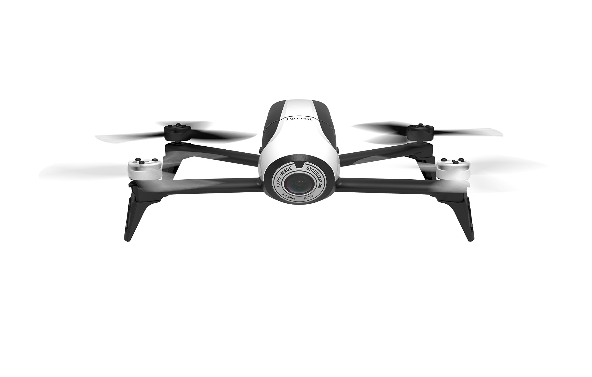
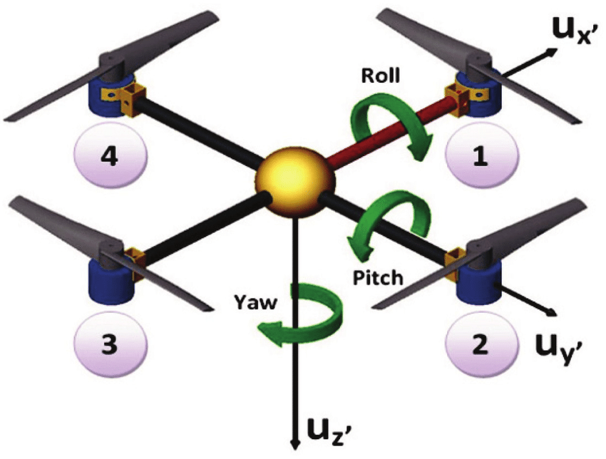
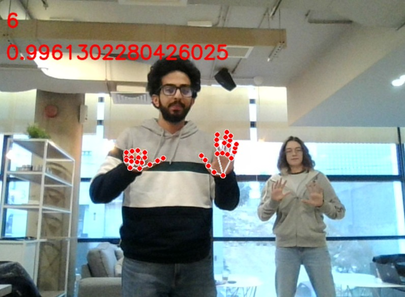
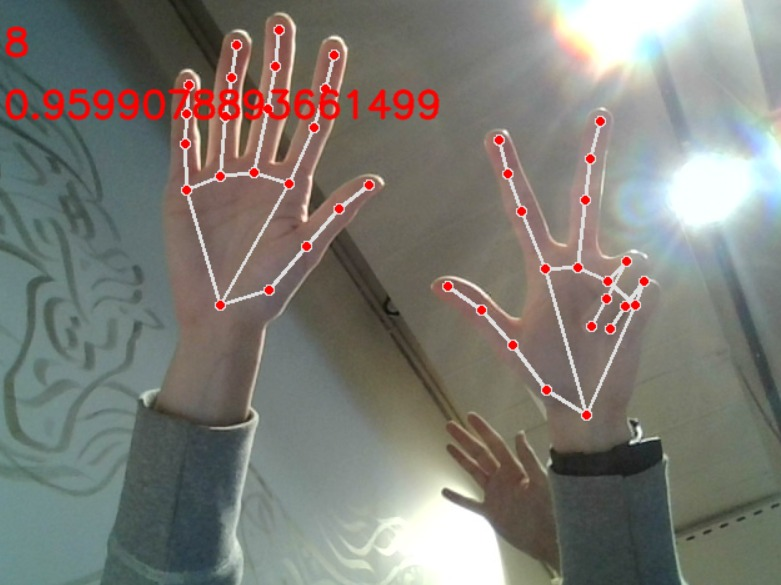
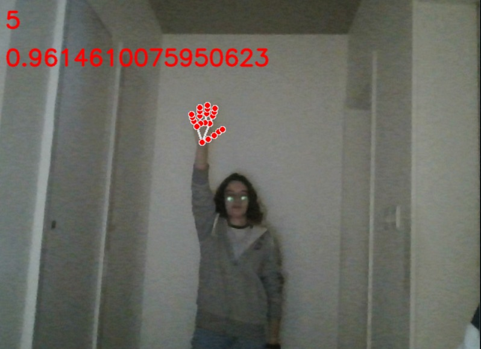

# pyparrot-control-using-hand-gesture

## 📖 Description

This project is a proof of concept for controlling a drone using hand gestures. The project is based on the [pyparrot](https://pypi.org/project/pyparrot/) library.




The project is divided into two parts:
1. `hand_gesture_recognition` which is responsible for detecting hand gestures and sending the appropriate command to the drone.
2. `drone_control` which is responsible for receiving the command from the `hand_gesture_recognition` and controlling the drone.

This project uses the [mediapipe](https://pypi.org/project/mediapipe/) library for hand gesture recognition.

## 🛠️ Requirements

- Ubuntu
- miniconda

## 💻 Installation


1. create `conda` virtual environment by running this command:

```
$~ make virenv
```

2. activate the environment by running this command:

```
$~ conda activate parrot-env
```


3. install requirements by running this command:

```
$~ make install
```

## 📑 Usage

1- You have to connect to the drone WiFi network. Example: `RS_XXXXXXXXXX`

2- Run the `main.py` file in the `src` directory, using this command:
    ```
    $~ python src/main.py
    ```

**BECAREFUL: BY RUNNING THIS COMMAND THE DRONE WILL TAKEOFF **

> if you want to test the `FingersCounter` class, you can run `test.py` file in the `src` directory, using this command:
    ```
    $~ python src/test.py
    ```


This is the list of commands to control the drone:
| Finger | Command |
|--|--|
| 0 | Land |
| 1 | Hover in place |
| 2 | pitch forward |
| 3 | pitch backward |
| 4 | roll right |
| 5 | roll left |
| 6 | yaw right |
| 7 | yaw left |
| 8 | go up |
| 9 | go down |




## 📹 Examples

Here are some examples of the hand gesture recognition:

### 📹 1



### 📹 2



### 📹 3




## 🌀 Configurable Parameters

You can change the following parameters in the `config.yaml` file:

| Parameter | Description |
|--|--|
| min detection confidence | minimum hand detection confidence |
| min tracking confidence | minimum hand tracking confidence |
| take off altitude | altitude to take off to |
| duration | duration of the command (the bigger the slower)|


## 🧪 Testing

You can test the project by running this command:

```
$~ make test
```


## 📚 FAQ

### What type of drones are supported by this project?

This project is based on the [pyparrot](https://pypi.org/project/pyparrot/) library. It supports only the Bebop 2 drone.

### Is there any specific hardware requirements for using this project?

No, you can use any laptop or desktop computer.

### How do I calibrate the hand gesture recognition system?

You can calibrate the hand gesture recognition system using the configurablesparameters in the `config.yaml` file. Check the [Configurable Parameters](#configurable-parameters) section for more details.

### How do I calibrate the drone control system?

You can calibrate the drone control system using the configurable parameter `duration` in the `config.yaml` file. Check the [Configurable Parameters](#configurable-parameters) section for more details.


### What safety precautions should I take when using this project?

You should be careful when using this project. You should be aware of the surroundings and make sure that there are no obstacles in the drone's path. You should also make sure that the drone is not flying too high out of the WiFi range.

Also you should take care when running the `main.py` file. By running this file, the drone will takeoff. So make sure that you are in a safe place before running this file.

### How to test the project without a drone?

For testing the project without a Parrot Bepop 2 drone, you will be testing the `hand_gesture_recognition` part only. To do that, you can run this command:

```
$~ python src/test.py
```


## 📝 License

This project is licensed under the MIT License - see the [LICENSE](LICENSE) file for details

## 📚 References

- [pyparrot](https://pypi.org/project/pyparrot/)
- [mediapipe](https://pypi.org/project/mediapipe/)

## 🔼 Contribution

If you want to contribute to this project, you can do it by forking the project and creating a pull request.
